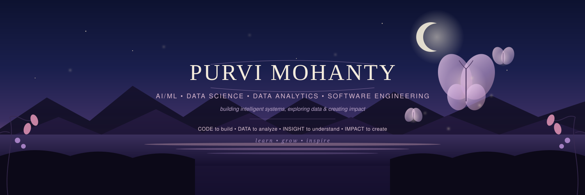

 

 

 

<table>
<tr>

<td width="65%" valign="top">

## 🌙 about me

I'm **Purvi**, an Information Technology undergraduate at
**SRM Institute of Science and Technology**, passionate about the
intersection of **AI, Data Science, Data Analytics and Software Engineering**.

- 🔭 Currently building AI/data systems at **L&T**
- 🌱 Exploring **AI Agents, LLM Applications, Data Engineering & MLOps**
- 📊 Interested in **Data Science, Analytics & Machine Learning**
- 🛰️ Previously worked with **geospatial & satellite data at ORSAC**
- 💻 I enjoy building **APIs, data pipelines and intelligent applications**
- 🎓 **CGPA: 9.63/10**
- 🏆 **IndiaAI Impact GenAI Hackathon Finalist**

</td>

<td width="35%" align="center">

  

coding, learning & probably debugging 🐾

</td>

</tr>
</table>

 

---

## 🔭 currently working on

**AI/ML systems involving document ingestion, vector databases,
embeddings and semantic search.**

## 🌱 currently learning

`AI Agents` · `LLM Applications` · `Data Engineering` · `MLOps`

## 💬 ask me about

`Python` · `SQL` · `Data Science` · `Machine Learning`
· `Power BI` · `Geospatial AI`

---

# 🛠️ technologies & tools

### 💻 Languages

  

### 📊 Data Science & Analytics

  

### 🤖 AI / Machine Learning

  

### ⚙️ Backend & Development

  

### 🗄️ Databases & Data Systems

  

---

# 🌸 featured projects

<table>
<tr>

<td width="50%" valign="top">

### 🛡️ VeriSphere

**AI-powered identity verification & fraud detection**

`Python` `YOLOv8` `OCR` `Machine Learning` `Flask`

A modular verification pipeline combining document
parsing, OCR, QR validation and anomaly detection.

 

</td>

<td width="50%" valign="top">

### 🌍 GeoLLM Odisha

**Geospatial AI & natural-language querying**

`Python` `GIS` `LLMs` `Google Earth Engine` `Flask`

A platform combining geospatial datasets with
natural-language querying for spatial analysis.

 

</td>

</tr>

<tr>

<td width="50%" valign="top">

### 🌊 Sahayak AI

**Agentic AI for disaster response**

`Python` `FastAPI` `IBM Granite` `Agentic AI`

An AI-driven system combining weather information,
alerts and intelligent recommendations.

 

</td>

<td width="50%" valign="top">

### 💻 CacheFlow

**High-performance caching proxy server**

`Python` `Backend Systems` `LRU Cache`

A backend system designed to reduce redundant API
requests and improve request-handling efficiency.

 

</td>

</tr>
</table>

---

# 📊 data science & analytics

### turning raw data → insights → decisions

<table>
<tr>

<td width="50%">

### 🔎 Data Analysis

- Exploratory Data Analysis
- Data Cleaning & Validation
- Statistical Analysis
- Trend Analysis
- Root Cause Analysis

</td>

<td width="50%">

### 🤖 Data Science

- Feature Engineering
- Predictive Modeling
- Classification
- Anomaly Detection
- Machine Learning

</td>

</tr>

<tr>

<td width="50%">

### 📈 Visualization

- Power BI
- Excel
- Matplotlib
- Seaborn
- Dashboard Development

</td>

<td width="50%">

### 🗃️ Data

- Python
- SQL
- Pandas
- NumPy
- MySQL
- PostgreSQL

</td>

</tr>
</table>

---

# 💼 experience

### 🌸 L&T — AI/ML Intern

**Jul 2026 – Present**

Working with **Python, FastAPI, Docker and Weaviate** to build
REST APIs and AI/data workflows involving document ingestion,
embeddings, vector storage and semantic retrieval.

### 🛰️ Odisha Space Applications Centre — Software / ML Intern

**Jun 2025 – Jul 2025**

Worked with **geospatial and satellite datasets**, Python data
pipelines, preprocessing, feature engineering and automated
thematic-map generation.

---

# 🏆 achievements

🌷 **9.63 / 10 CGPA**

&nbsp;&nbsp;•&nbsp;&nbsp;

🏆 **IndiaAI Impact GenAI Hackathon — Finalist**

&nbsp;&nbsp;•&nbsp;&nbsp;

🥈 **NPTEL — Big Data Computing Silver Medal**

  

🥇 **1st Prize — National Science Day Oral Presentation**

&nbsp;&nbsp;•&nbsp;&nbsp;

🎤 **Top 24 — Speak for India**

---

# 📜 certifications

- 🎓 **Supervised Machine Learning** — Stanford University
- 📊 **Big Data Computing** — NPTEL
- ☁️ **Microsoft Fabric SQL**
- 💻 **Computer Architecture** — NPTEL

---

# 🌱 currently exploring

`AI Agents`

✦

`LLM Applications`

✦

`Data Engineering`

 

`MLOps`

✦

`Scalable AI Systems`

✦

`Advanced Analytics`

---

# 🌿 beyond code

💃 **Bharatanatyam**

&nbsp;&nbsp;·&nbsp;&nbsp;

🎶 **Music**

&nbsp;&nbsp;·&nbsp;&nbsp;

🌿 **Nature**

&nbsp;&nbsp;·&nbsp;&nbsp;

📚 **Learning**

  

probably thinking about my next project while doing all of the above ☕

---

 

### 🦋 let's build something meaningful

  

*learn • grow • inspire* 🌷

